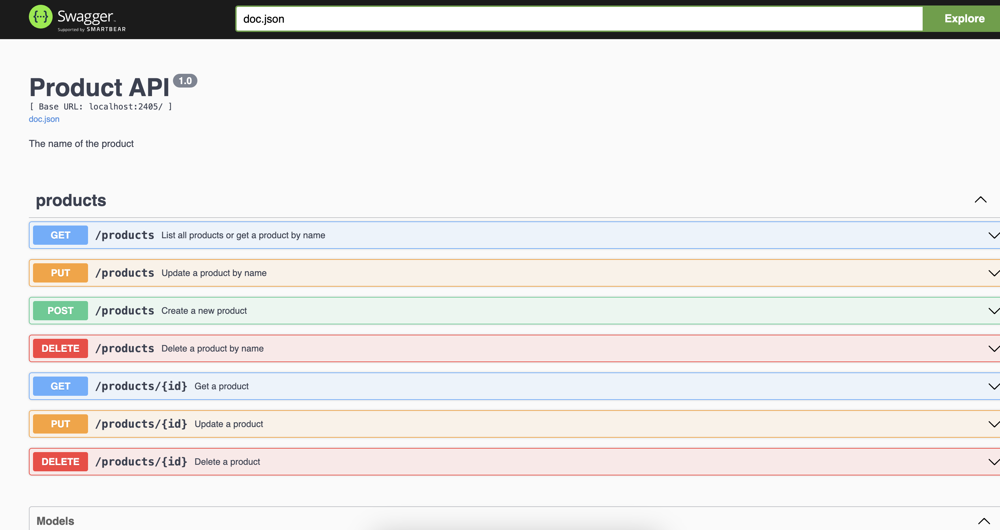

# Product Management System APIs

This is a simple CRUD Go API that allows users to manage products in a store. It is powered by an SQLite database and Go Gin framework.

## Prerequisites

You need Go 1.17 or higher to run this app

## Set up

Set this up by cloning this repo and creating an .env file. Do so with this command

```
cp .env.example .env
```

### Running the app

You can run the app by either building first and running as an executable or running directly. Here are both cases:

1. Build and run

```sh
go build -o productapi
./productapi
```

2. Run directly

```sh
go run main.go
```

If you start the app with the defaults, it will run on port 2400 and set up a database in the root directory called `database.db`

## Running unit tests

You can run the included unit tests for the APIs using the command below:

```
go test -v ./...
```

Example test output

```
=== RUN   TestCreateProduct
[GIN] 2024/10/22 - 22:27:19 | 201 |      310.25µs |                 | POST     "/products"
--- PASS: TestCreateProduct (0.00s)
```

## API docs

The API is documented with swagger. You can test it out on the swagger browser interface: https://productapi.osinachi.me/swagger/index.html


